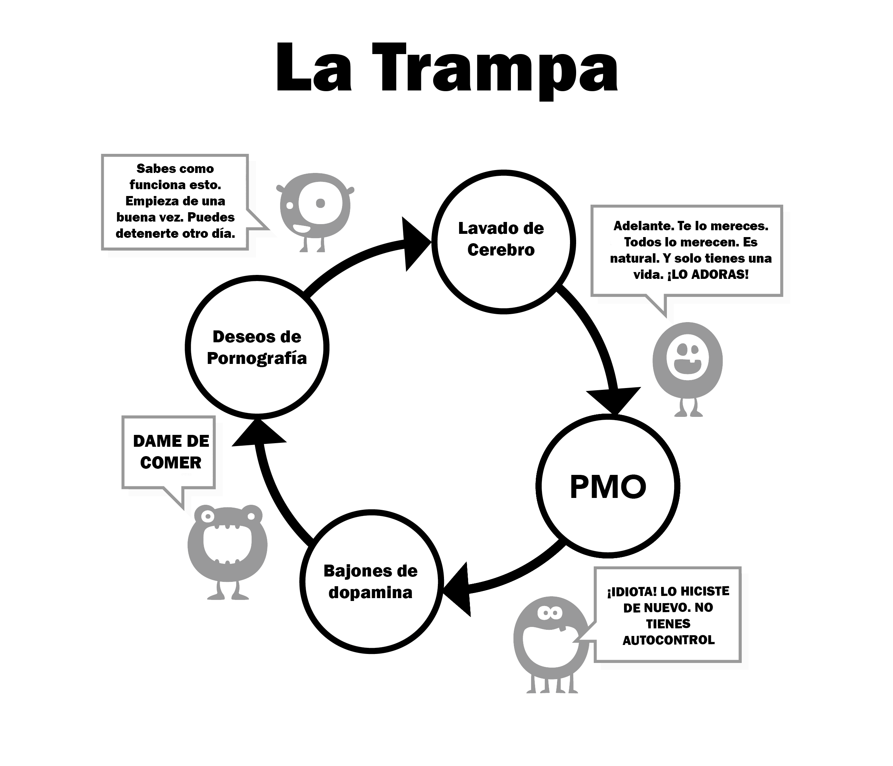

# Lavado de cerebro {#lavado-de-cerebro}

Esta es la segunda razón por la que empezamos a usar porno. Y para entenderlo por completo es necesario que nosotros examinemos primero los poderosos efectos de los estímulos supranormales. Nuestros cerebros simplemente no están preparados para la creación de un “Harem en línea”, el cual nos permite ‘hojear’ entre una mayor cantidad de potenciales parejas en 15 minutos de lo que nuestros ancestros pudieron en varias vidas.

Ha habido vasta cantidad de consejos sobre la masturbación en el pasado que resultan equívocos, como aquel mito de que la masturbación conduce a la ceguera. Esta, junto con otras tácticas de miedo, son claras exageraciones. Conceptos así de erróneos ya han sido derrocados gracias a las investigaciones científicas. Pero ya ‘se ha echado toda la carne al asador’; desde nuestros años más jóvenes, somos bombardeados de forma subconscientemente con mensajes e imágenes sexuales, con revistas y anuncios cargados de insinuaciones. Incluso con algunos videos de música pop siendo extremadamente sugerentes; aunque no te desesperes, trata de convertirlo en un juego, e identifica qué componentes usan: si buscan causar impacto, sentimientos de novedad, que colores usa, las proporciones corporales, sí se toca un tema tabú, si trata de evocar nostalgia, etc. Incluso un juego como este puede ser enseñado a preadolescentes como una forma de educarlos.

En última instancia, el mensaje que propone todo este bombardeo es: _“La cosa más preciada en esta tierra, mi último pensamiento y acción, será el orgasmo”_. ¿Acaso exagero? Ve cualquier serie o película de streaming, y verás la mezcla que usan sobre la parte sensorial (tacto, olor y voz) y la parte propagativa (orgásmica) del sexo. Esto no tiene un registro muy fuerte en nuestra consciencia, pero el subconsciente tiene tiempo para absorber el mensaje.

## Razonamiento científico

Hay mucha publicidad en Internet que te anima a dejar el porno con otro enfoque; páginas que tratan de asustarte con el concepto de disfunción eréctil, con la pérdida de motivación, la preferencia del porno virtual a las chicas reales, _‘YourBrainOnPorn’_ y otras varias subculturas de internet. Sin embargo, estos movimientos en realidad no detienen a las personas de usar pornografía. Lógicamente hablando, deberían hacerlo, pero el simple hecho es que no. Ni siquiera los riesgos para la salud que son enumerados en estudios revisados por pares, y que a su vez son expuestos en _YourBrainOnPorn_ son suficientes para evitar que un adolescente comience con la adicción.

Irónicamente, la fuerza más poderosa en toda la confusión que atormenta a los usuarios, son los propios usuarios. Es una falacia decir que los usuarios tienen voluntad débil, o que son personas físicamente débiles. Tienes que ser físicamente fuerte para poder hacer frente a una adicción después de saber que eres adicto. Y tal vez, el aspecto más doloroso de esto es que se colocan como perdedores, fracasados o como insufribles introvertidos. Es probable que un amigo tuyo podría ser más interesante en persona si no se hubiera enganchado a la idea de satisfacerse a sí mismo con porno en primer lugar. 

## Problemas al usar la fuerza de voluntad

Los usuarios que prefieren usar el método de la fuerza de la voluntad culpan a su propia falta de voluntad por sus fracasos, arruinando así su paz y su felicidad propia. Pero una cosa es fallar en la autodisciplina y otra muy diferente es auto-despreciarse. Después de todo, no hay ninguna ley que te obligue a estar erecto todo el tiempo, adecuadamente excitado y físicamente capaz de satisfacer a tu pareja en el momento. Estamos trabajando en una adicción, no en un hábito, y en ningún momento discutes contigo mismo para dejar un hábito como el golf, a pesar de que hacer lo mismo con la adicción al porno está normalizado, ¿por qué?

La exposición constante a un estímulo supranormal reconecta tu cerebro, por lo que construir una resistencia a este lavado de cerebro es algo crítico, como cuando compras un coche a un distribuidor de coches de segunda mano — asintiendo educadamente a todo, pero sin creer en ni una palabra de lo que dice el hombre. Necesitas entender el lavado de cerebro. Así que no creas que debes tener tanto sexo como puedas, ni siquiera si es el sexo más excepcional, mientras usas porno en su ausencia.

No juegues al juego seguro del porno tampoco: tu pequeño monstruo inventó ese juego para poder atraerte. ¿Acaso el porno amateur está certificado por alguna autoridad? Duh. Los sitios pornográficos recopilan datos de todos sus usuarios y los utilizan para satisfacer sus necesidades, tal así que si ven un repunte en una determinada categoría se enfocarán en ella y sacarán contenido lo antes posible. No te dejes engañar por la intención educativa o los "seguros" clips femeninos comerciales. Mejor empieza a preguntarte: _"¿Por qué lo estoy haciendo? ¿Realmente lo necesito?"_

**¡No, por supuesto que no!**
 
La mayoría de los usuarios juran que solo ven porno ‘seguro y estático’, y que por lo tanto están a salvo, cuando en realidad están tirando de la correa, peleando con toda su fuerza de voluntad para resistir a las tentaciones. Cosa que, si se hace con demasiada frecuencia y por demasiado tiempo, agotará su fuerza de voluntad considerablemente y hará que empiecen a fallar en otros proyectos de vida donde la fuerza de voluntad es de gran valor; como en el ejercicio, la dieta, etc. El fracaso en estas áreas los hará sentirse miserables y culpables, haciéndoles caer y recaer en la pornografía. Y si esto no se detiene, terminarán por desahogar su ira y depresión sobre sus seres queridos…

Una vez te conviertes en un adicto a la pornografía, el lavado de cerebro incrementa. Tu subconsciente sabe que el pequeño monstruo debe ser alimentado, así que bloquea todo lo demás. Ese miedo mantiene a las personas alejadas de dejar el porno, ese miedo al vacío, ese sentimiento de inseguridad que tienen al dejar de inundar sus cerebros con dopamina. Solo porque no lo sepas no significa que no esté ahí. Tú no tienes que entender más de lo que un gato tiene que entender sobre dónde están las pipas de agua caliente; el gato solo se sienta si el lugar está caliente. 

\

## Pasividad

La pasividad de nuestras mentes para absorber información, y la dependencia de una autoridad son factores que conducen al lavado de cerebro, además de ser la principal dificultad para dejar al porno. Eso, junto con nuestra crianza en la sociedad, reforzada por el lavado de cerebro de nuestra propia adicción y combinada con los lavados de cerebro más poderosos: nuestros amigos, familiares y colegas. Decir que vas a "renunciar al porno" es un ejemplo clásico de lavado de cerebro, que implica un sacrificio genuino. Cuando la hermosa verdad es que no hay nada a lo que renunciar; al contrario, te liberarás de una terrible enfermedad y obtendrás maravillosas ganancias positivas. Comenzaremos a remover este lavado de cerebro ahora, empezando por no referirse a "renunciar" sino a parar, ‘dejar de’ o quizá la verdadera naturaleza de todo esto, **¡Escapar!**

Lo único que nos persuade a usar porno inicialmente es que otras personas lo hagan, sintiendo que nos lo estamos perdiendo. Trabajamos duro para engancharnos a nosotros mismos, aun cuando nunca encontramos aquello de lo que nos estábamos perdiendo. Cada vez que vemos otro clip, nos hacemos a la idea de que debe haber algo en él, porque de lo contrario, la gente no lo estaría haciendo y el negocio no sería tan grande. Incluso después de dejar el hábito, el ex-usuario siente que está siendo privado cuando, entre los asistentes de una reunión o fiesta, discuten acerca de lo sexy que es una actriz de cine, artista o incluso actriz porno. _“Su contenido debería ser bastante bueno si todos mis amigos hablan de eso, ¿Cierto? ¿Tendrá alguna foto suya en internet?”_ Ellos se sienten seguros, por lo que solo echaran un vistazo esta noche. Pero para antes de que lo sepan, ya estarán enganchados.

El lavado de cerebro es extremadamente poderoso y tú necesitas ser consciente de sus efectos. La tecnología sigue avanzando y el futuro traerá sitios y métodos de acceso exponencialmente más rápidos. La industria del porno ya está invirtiendo millones en realidad virtual para que se convierta en el próximo ‘hit’. Nosotros no sabemos para dónde vamos, y ni siquiera tenemos los recursos biológicos para poder lidiar con la tecnología del presente, o con la que viene.

Estamos a punto de eliminar este lavado de cerebro, así que, por favor, hazte a la idea de que no es el no-usuario el que se ve privado, sino el usuario el que pierde toda una vida de:

* Salud
* Energía
* Riqueza
* Paz mental
* Confianza
* Coraje
* Auto-respeto
* Felicidad
* Libertad

¿De qué se pierden los usuarios al sacrificar el porno por estos aditivos? **DE ABSOLUTAMENTE NADA**, aparte de la ilusión de tener que obtener de vuelta su estado de paz, su tranquilidad y su confianza usando el porno, cosa de la cual los no-usuarios disfrutan _sin_ porno.

## Los dolores de abstinencia

Como se explicó anteriormente, los usuarios creen que usan porno para su disfrute, relajación o como una especie de educación sexual. Cuando la verdadera razón es porque tienen que aliviar los dolores de abstinencia. Nuestro subconsciente empieza a aprender que el porno y la masturbación cada cierto tiempo tienden a ser placenteros. Pero a medida que incrementamos nuestro enganche en la droga, más grande es la necesidad de aliviar esa abstinencia y cuanto más te arrastra sutilmente a la trampa. Este proceso ocurre tan lentamente que no eres consciente de él, como con la mayoría de los jóvenes usuarios que no se dan cuenta que son adictos hasta que tratan de detenerse, e incluso cuando muchos de ellos no lo admiten.

Mira esta conversación que un terapeuta suele tener con cientos de jóvenes, por ejemplo:

**Terapeuta:** _“¿Te das cuenta de que el porno es una droga y la única razón del porque la usas es porque no puedes parar?”_

**Paciente:** _“¡No tiene sentido! Yo lo disfruto, y puedo parar si me lo propongo.”_

**Terapeuta:** _“Solo para por una semana para probarme que puedes si así lo quieres”_

**Paciente:** _“No, lo necesito, lo disfruto. Sí quiero detenerme lo haré sin problema.”_

**Terapeuta:** _“Solo detente por una semana para probarte que no estás enganchado”_

**Paciente:** _“¿Cuál es el punto? Lo disfruto”_

Como ya se dijo, los usuarios tienden a aliviar sus dolores de abstinencia en momentos de estrés, aburrimiento, concentración o en combinación de estos. Por lo tanto, en los siguientes capítulos, nos centraremos en estos aspectos del lavado de cerebro.
