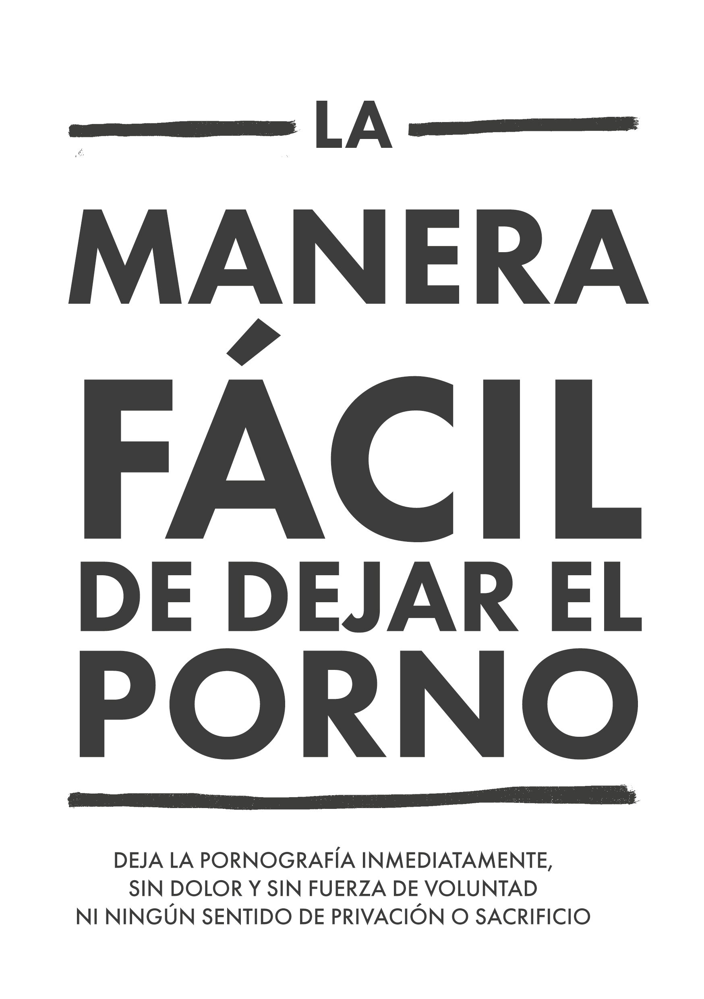

# Introducción {#introduccion}

{width=45% height=45%}\

El método EasyPeasy para dejar la pornografía. Deja el porno de manera rápida, indolora, sin usar el método de fuerza de voluntad y sin sentirte privado.

https://easypeasyespanol.github.io/

**[PDF](https://easypeasyespanol.github.io/easypeasyespanol.pdf) | [EPUB](https://easypeasyespanol.github.io/easypeasyespanol.epub) | [AUDIOLIBRO](https://www.youtube.com/playlist?list=PLvRgPTmD1BRK2Hrh4B_lxqoDNdrMhI4MD)**

**Acerca de los traductores:**

* Traducción al español por **NegroBienDespierto**
    * Su página: https://www.facebook.com/NegroBienDespierto/
* Conversión a R Markdown por **porog**
    * Su página: https://www.youtube.com/channel/UCw0bSPMyQ3bL_8Ejf_DLFQg
* Imagen de portada por **Allan Gomes**
    * Su página: https://github.com/agomesp
* Audiolibro por **Franco Galeano**
    * Su página: https://www.youtube.com/channel/UCjIBnGOcMX2C6BqLETB9iAQ

---

**Notas de los traductores**

Puede que algunas frases y palabras parezcan algo raras al lector español. Preferimos ser fieles al estilo directo y coloquial de Allen Carr, ya que es importante comunicar sus ideas fielmente y su lenguaje se ha probado con eficacia. Con EasyPeasy tendrás la oportunidad de aclarar cualquier duda o temor que puedas tener en el asunto de la pornografía.

---

_**¡NO TE SALTES NINGÚN CAPÍTULO!**_

¡Hola! Soy Dom, del equipo de traducción de EasyPeasy. Esta traducción se hizo tomando como base la versión lanzada por _Hackauthors²_ el 16 de septiembre de 2021. Esta nueva versión incluye notas personales referentes a los proyectos del autor, así como la idea de reescribir la versión en inglés de EasyPeasy. Dado que estas notas no competen a la traducción, te pedimos por favor, darle una visita al [sitio original](https://easypeasymethod.org/) si deseas checar estas notas, así como para leer la versión original de este libro si gustas.

Sin más que agregar, un abrazo hasta donde estés. Esperamos te sea de ayuda este libro.

_**¡NO TE SALTES NINGÚN CAPÍTULO!**_

Este libro de código abierto te permitirá dejar de usar pornografía **inmediatamente, sin dolor y permanentemente**; sin usar fuerza de voluntad y sin aplicar ningún sentido de privación o sacrificio. No te pondrá a juicio, no te hará sentir vergüenza ni te pondrá presión para someterte a ninguna medida dolorosa.

De hecho, no hay ninguna necesidad de reducir o suspender tu consumo de pornografía mientras se lee; hacerlo es en realidad perjudicial.

Quizá estés preocupado por el hecho de solo pensarlo, o preocupado por pensar en los millones de personas que están tratando de dejar el porno. Si es así, entonces quizá sea porque todo lo has leído acerca de pornografía vaya en contra de todo lo que se te ha dicho sobre ella, pero, antes que nada, pregúntate: ¿Todo lo que te han dicho ha funcionado? Porque, de haber sido así, no estarías leyendo esto entonces. 

Considera si las siguientes preguntas se aplican en tu caso:

* ¿Pasas mucho más tiempo viendo pornografía del que tenías planeado inicialmente?
* ¿Siempre fallas en tus intentos por detener o limitar tu consumo de pornografía?
* ¿El tiempo que pasas viendo pornografía ha interferido o tomado prioridad sobre tu vida personal o profesional? ¿Sobre tus compromisos, pasatiempos o sobre las relaciones en tu vida?
* ¿Haces todo lo posible para mantener tu consumo de pornografía en secreto? (Ejem: Eliminar el historial, entrar en modo incógnito, mentir acerca de tu consumo, etc.)
* ¿Ver pornografía ha causado problemas significativos en tus relaciones íntimas?
* ¿Experimentas un ciclo de excitación y disfrute antes y durante tu consumo de pornografía, seguidos de un sentimiento de vergüenza, culpa y remordimiento?
* ¿Pasas una cantidad significativa de tiempo pensando en pornografía, incluso cuando no la estas consumiendo?
* ¿Ver pornografía ha causado otras consecuencias negativas en tu vida personal y profesional? (Ejem: Llegar tarde al trabajo, tener un desempeño deficiente, tener relaciones desatendidas, problemas financieros, etc.)

Si eres un usuario de pornografía que depende de ella para masturbarse o tener sexo, lo único que tienes que hacer es **seguir leyendo**. Si estás aquí por un ser amado, lo único que tienes que hacer es persuadirlo para que lea este libro. Pero de no poder persuadirlo, entonces lee el libro tú mismo. Entender el método te ayudará a poder llevar el mensaje a otras personas, evitando que incluso tus hijos empiecen. No te dejes engañar por el hecho de que no tienen acceso al porno ahora — **todos lo hacemos antes de engancharnos**.

## Acerca del libro {-}

Este libro es una versión reescrita de una adaptación reescrita del libro _“Es fácil dejar de fumar si sabes cómo”_ de _Allen Carr_ para dejar de usar pornografía, es completamente **gratis y de código abierto**, además de estar licenciado bajo Creative Commons (CC-BY-SA). El éxito de este método se basa en el fundamento de que:

_**¡NO TE SALTES NINGÚN CAPÍTULO!**_

Cuando estás abriendo un candado, tienes que poner los números en el orden correcto. La adicción no es nada diferente. 

Personalmente, la versión original de [_Google Sites_](https://sites.google.com/site/sites/system/errors/WebspaceNotFound?path=%2Fhackbookeasypeasy) (La que no fue escrita por mí) cambió mi vida. Si eres como la mayoría de la gente, descubriste la pornografía a una edad temprana y la seguiste usando desde entonces. Eso, hasta encontrarte con la abrumadora — y aun así censurada — literatura que advierte los peligros de esta. Así como yo, quizá hayas sobrevivido algunas largas rachas de días sin usarla, solo para terminar sucumbiendo a ilusorios impulsos. Así pues, tengo el gusto de comentarte que este método funciona completamente diferente, y es el único que funciona.

O quizá hayas llegado a este libro por un compañero que está preocupado por ti, y eres escéptico. Antes que nada, gracias por darle un ojo, aunque sea. Desarrollare el funcionamiento de este método brevemente, pero primero, quiero que recuerdes la primera vez que viste pornografía. ¿Pensaste que regresarías a ese lugar durante el resto de tu vida? Según mis propios estudios informales sobre el tema (o sea, molestando a mis amigos para que lean este libro), EasyPeasy es igual de efectivo para los usuarios casuales como para los más adictos al porno. No es demasiado largo, con grandes posibilidades de grandes ganancias, así que te suplico, sigue leyendo. 

El método descrito en este _hackbook_ es:

* Instantáneo. 
* Igual de efectivo con usuarios casuales y profundamente adictos.
* No causa ningún _dolor de abstinencia_.
* No requiere de fuerza de voluntad.
* No requiere de ningún truco, ayuda o _tratamiento de shock_.
* No te hará reemplazar esta adicción con otra, como fumar, beber alcohol o comer de más.
* Permanente.

Quizá encuentres esto imposible de creer, pero es un sentimiento que hace eco para muchas personas:

* > “Este es el trabajo fundamental respecto a la adicción a la pornografía”  
> \- Un tipo en Reddit que no puedo encontrar, no creo que la broma fuera intencional.

* > “Fui adicto a la pornografía por 10 años. Esos 10 años estuve paralizado por la depresión, las dudas y la ansiedad de que mi secreto saliera a la luz. Después de cada sesión, me odiaba a mí mismo, y después de cada dieta pornográfica estaba de vuelta en el tobogán en poco tiempo. Sin embargo, este libro me ayudó a parar. Siempre estuve a la defensiva del porno en el pasado. Ahora, y después de leer este libro por segunda vez, estoy a la ofensiva. El porno no tiene control sobre mí y se siente como una broma de mal gusto ahora”  
> \- u/DeepNewt

* > “Hace unos días, cumplí 20 años. Por primera vez en mucho tiempo, pasé mi cumpleaños libre de la trampa del porno, y es gracias a este libro que me encontré por ahí hace meses. Antes de eso, pasaba mucho tiempo tratando de dejar el porno a través de métodos tradicionales, y experimenté mucha confusión interna y me catalogué por siempre como un adicto. Este libro resolvió todo eso por mí. Donde anteriormente temía el no tener control sobre mí mismo, incluso cuando, sin saberlo, ya había vencido al pequeño monstruo, ahora puedo sentirme orgulloso al darme cuenta de que no necesito ser un adicto nunca más.  
> En realidad, no tengo ninguna razón para publicar esto. Solo sentía que debía poner esto en algún otro lado que no fuera mi cabeza, porque significa mucho para mí. Si estás leyendo esto y piensas en leer el libro o recomendarlo, créeme que funciona mejor que cualquier otro método allá afuera. El mejor tip que te puedo dar es que tomes notas; sé que suena gracioso, pero me ayudó a solidificar algunas ideas.”  
> \- u/Suspicious_Web_4594

* > “basado”  
> \- anon, /fit/

## Advertencia

Si esperas que este libro _te asuste_ hasta parar con los diversos riesgos de salud que los usuarios corren, como lo son la _disfunción eréctil_ (incluida la disfunción eréctil inducida por pornografía), la excitación sexual poco confiable, perdida de interés en el sexo real, hipofrontalidad cerebral, y la cegadora acusación de que es un hábito asqueroso y repugnante y que _tú_ eres una estúpida y floja medusa con falta de fuerza y una voluntad débil, estarás muy decepcionado. Esas tácticas nunca me ayudaron a dejar el porno, y si te fueran a ayudar a ti, ya lo habrías hecho.

Los métodos convencionales usados para dejar el porno defienden el uso de **la fuerza de voluntad** o métodos de sustitución como las **dietas pornográficas** (_Volveré a ver porno cada X días_) o reducir el consumo a 0 de tajo. Algunos sitios de internet engloban listas de estudios _revisados por pares_ acerca de _neurotransmisores y neuro plasticidad_, y a pesar de que son sitios informativos, muchos son conscientes de los riesgos de salud y escogen no hacer nada, a pesar de que este material suele evitarse muy a menudo. Estos métodos, en última instancia, son igualmente ineficaces debido al hecho de que no remueven las razones por las que consumimos porno. Y en última instancia, convertir algo en una especie de _fruta prohibida_ no es una forma coherente de combatir una adicción.

Este método, denominado como _EasyPeasy_, trabaja de otra forma. Algunas de las cosas que se dirán aquí quizá sean difíciles de creer, pero para cuando acabes este libro, no solo terminarás creyéndolas, sino que también te preguntarás cómo habrás sido engañado para creer lo contrario.

Existe la idea errónea de que _elegimos ver pornografía_. Los adictos al porno (Sí, adictos) no escogen conscientemente ver porno, así como los alcohólicos convertirse en alcohólicos, o los adictos a la heroína volverse adictos. Es cierto que nosotros escogemos encender la laptop o el celular, entrar a nuestro buscador y visitar nuestro _“harem en línea”_ de preferencia. Pero trata de verlo así: ocasionalmente, yo escojo ir al cine, pero estoy seguro de que no escogí quedarme dentro del cine toda la vida. Originalmente, la curiosidad y la naturaleza humana me llevaron ahí, pero nunca hubiera empezado de haber sabido que me convertiría en un adicto, causando el declive de mi salud, felicidad y relaciones. _“¡Oh, de haber sabido acerca de la disfunción eréctil en mi primera visita a esa página porno!”_

Tomate un momento para reflexionar: ¿Alguna vez tomaste la decisión _“positiva”_ de que necesitas/tienes que usar porno para masturbarte? ¿O de que deberías tener/necesitas tener/debes tener fantasías inducidas por el porno para darle un poco de _picor_ al sexo que tendrás con tu pareja? ¿O de que, en ciertos momentos de tu vida, no podías disfrutar de una buena noche de descanso o quizá tener una tarde después de un arduo día de trabajo sin tener que navegar en páginas porno? ¿O de que no podías concentrarte o manejar el estrés sin porno? ¿En qué momento decidiste que _necesitabas_ de la pornografía, de que la _necesitabas_ permanentemente en tu vida, sintiéndote inseguro, incluso asustado sin porno, sin tu _online harem_ favorito?

Como cualquier otro usuario, has sido atraído a la trampa más sutil y siniestra que el hombre y la naturaleza han podido idear. No ha vivido persona alguna, siendo un usuario o no, que le guste la idea de que sus hijos usen pornografía para poder lidiar con su vida o para sentir placer. Esto significa que todos los adictos desearían nunca haber iniciado. No es sorpresa para nadie; nadie necesita del porno para disfrutar de su vida o lidiar con el estrés.

Y al mismo tiempo, todos los usuarios desean continuar usándolo. Después de todo, nadie nos obliga a iniciar el modo incógnito en nuestros navegadores. Entiendan la razón del por qué lo hacen o no, son los usuarios los que deciden arrastrarse a las puertas de su _“online harem”_.

Si existiera un botón mágico que le diera la oportunidad al usuario de despertar la mañana siguiente como si nunca hubiera tenido esa primera sesión en aquella página porno, los únicos adictos hoy en día serían chicos jóvenes que aún _“están experimentando”_.

¡La única cosa que nos previene de dejar este vicio es _**EL MIEDO**_! Miedo causado por la creencia de que tendremos que sobrevivir un periodo de tiempo indefinido de miseria, privación o ansia insatisfecha para librarnos del porno. Estas creencias son engendradas a su vez por otras creencias más irracionales, aprendidas y/o adquiridas:

* La masturbación o el sexo que termina en orgasmo son las _únicas y más importantes_ cosas en la vida. 
* El porno es _“más seguro”_ que el sexo real porque _“eL PoRNo nO PUEde ReChaZARme”_.
* El porno es educativo y útil.
* Es un derecho a una experiencia sexual _“superior”_. 
* _Más es mejor_.

Estas creencias irracionales resultan en consecuencias irracionales cuando se ponen en práctica, como lo son:

* Idolatrar u obsesionarse cuando alguien de características _10/10_ es encontrado/a.
* Percibirte a ti mismo como un perdedor si no tienes sexo, como si fuera la cosa más importante en la experiencia humana.
* Esperar a que una persona sea _10/10_.
* Ser excesivamente crítico o juzgar demasiado cuando se trata de parejas sexuales.
* Forzarte a tener sexo, quieras o no.

Es miedo a que una noche a solas será miserable, gastando tus energías luchando contra impulsos incontrolables. Miedo a que una noche antes de tu importantísimo examen va a ser una noche de infierno sin porno. Miedo a que nunca podrás manejar el estrés, concentrarte o tener mucha más confianza en ti mismo sin tu pequeño _“apoyo”_, y que tu personalidad y carácter cambiarán por completo, para siempre.

Pero, sobre todo, miedo a que _“una vez un adicto, siempre un adicto”_: de que nunca podrás ser completamente libre, pasando el resto de tu vida ansiando ese orgasmo ocasional inducido por porno en tiempos difíciles. Es como si, como en mi caso, hubieras intentado todas las formas convencionales para abandonarlo, pasando por la miseria y tortura del _“método de la fuerza de voluntad”_, siendo no solo afectado por ese miedo, sino también convencido de que nunca podrás abandonar.

Si estás preocupado, asustado, o sientes que no es buen momento para dejarlo, permíteme asegurarte que tus preocupaciones o miedos no son aliviados por el porno - son causados por ello. No decidiste caer en la trampa del porno, pero como todas las trampas, está diseñada para asegurarse de que sigas atrapado. Pregúntate: ¿Cuándo viste esas primeras imágenes, esos primeros videos, decidiste que volverías a verlas una y otra vez, por el resto de tu vida? ¿Entonces, cuándo pararas? ¿Mañana? ¿El próximo año? ¡Deja de engañarte! La trampa está diseñada para retenerte el resto de tu vida. ¿Por qué crees que todos los demás adictos no paran antes de que acabe con sus vidas?

Anteriormente mencioné un _“botón mágico”_; _EasyPeasy_ funciona justo como ese botón mágico. Déjame aclararlo, _EasyPeasy_ no es magia, pero para mí, y algunos que han encontrado que es fácil y divertido dejar el porno, ¡les parece que sí lo es!

Pero la advertencia es la siguiente: Es una situación de _“el huevo o la gallina”_: cada adicto quiere abandonarlo, y cada adicto puede hacerlo de forma fácil y divertida. Es el **miedo** el que nos previene de hacerlo. La ganancia más grande e importante de dejar el porno es deshacerse de ese miedo, pero no serás libre de ese miedo hasta acabar este libro. Por el contrario, tu miedo se hará más grande conforme avances la lectura, lo cual quizá te prevenga de terminar el libro. Toma por ejemplo este comentario hecho por una mujer:

_**“Acabo de terminar de leer EasyPeasy. Sé que solo han sido 4 días, pero me siento tan bien, sé que no necesitare de usar pornografía nunca más. Empecé a leer tu libro hace cinco meses, pero tan pronto llegué a la mitad entré en pánico. Sabía que si seguía leyendo tendría que parar. ¿Apoco no fui tonta?”**_

No decidiste caer en la trampa, pero ten claro que **no podrás escapar de ella a menos que tomes la firme decisión de hacerlo**. Quizá ya estés tirando de la correa para hacerlo, o quizá estés consternado al respecto. Pero, aun así, ten en cuenta que: _**¡NO TIENES NADA QUE PERDER!**_

Si al final del libro decides continuar usando pornografía para masturbarte o tener sexo, no hay nada que te prevenga de hacerlo.	No tienes que restringir o parar el uso de porno mientras lees de todas formas, y recuerda, no hay un tratamiento de shock. Al contrario, tengo buenas noticias para ti. ¿Te imaginas cómo se sintió Andy Dufresne cuando finalmente escapó de la prisión de Shawshank? Así es como me sentí cuando escapé de la trampa del porno, y así es como se sienten muchos ex-usuarios que han usado EasyPeasy. ¡Para cuando acabes el libro, así es como te sentirás! ¡Así que ve por ello!

## Finalmente... {-}

Todos pueden encontrar divertido y fácil dejar el porno, ¡Incluso tú! Todo lo que tienes que hacer es leer el resto del libro con una mente abierta; entre más entiendas, más fácil será. Incluso si no entiendes nada, siempre que sigas las instrucciones, será _pan comido_. Más importante aún, no iras por la vida deprimido porque no tienes porno o sintiéndote privado del mismo, y para cuando acabes el libro, el único misterio será por qué lo hiciste por taaaanto tiempo.

Con EasyPeasy, solo hay dos cuestiones por las cuales puedes fallar: 

**No llevar a cabo las instrucciones que se te dieron**. Algunos encuentran molesto que el libro sea tan dogmático con ciertas recomendaciones, como no dejar de usar de porno, o de no usar sustitutos. De hecho, no negaré el hecho de que hubo algunos que han logrado parar usando dichas artimañas, pero lo han logrado _a pesar de_, no gracias a dichas. Algunas personas pueden tener sexo en una hamaca, pero no es lo más fácil que digamos. Los números para abrir el candado de esta trampa están en este libro, pero deben de usarse en el orden correcto: _**yendo capitulo por capitulo, sin saltarse ninguno**_.

**No entender del todo**. No des nada por sentado. Cuestiónate no solo lo contenido aquí, sino también tus creencias y todo lo que la sociedad te ha dicho acerca del sexo, el porno y las adicciones. Por ejemplo, aquellos que creen que solo es un hábito, pregúntate por qué otros hábitos — los cuales son disfrutables — son fáciles de romper, mientras que un hábito que se siente horrible cuesta energía, tiempo y virilidad es tan difícil de romper. Para aquellos que creen que disfrutan del porno, pregúntate porque otras cosas que son infinitamente más disfrutables que el porno pueden ser tomadas o dejadas. ¿Por qué _necesitas_ del porno, además de sentirte asustado si no lo tienes?

EasyPeasy te dará todo el conocimiento necesario acerca de lo fácil y disfrutable que es dejar el porno. Como muchos otros, uno de mis más grandes triunfos en la vida fue escapar de esta trampa. No hay necesidad de sentirse deprimido, al contrario, vas a conseguir aquello que todo usuario en el planeta desearía conseguir: **¡LIBERTAD!**

**PERO RECUERDA, NO TE SALTES NINGUN CAPITULO. >:(**

Algunos términos antes de empezar:

_**PMO**_: El ciclo de porno, masturbación y orgasmo.

_**Harem, Harem en línea**_: Sitios que albergan pornografía a altas velocidades de internet.

_**MFV**_: El Método de la Fuerza de Voluntad

## Tips para tu lectura y algunas notas finales

**No leas este libro como si fuera un libro normal**, es muy corto, y deberías poder terminarlo en un par de horas. Algunas personas se benefician _enfatizando o tomando notas_, y recomiendan **darle otra leída para reforzar** algunas enseñanzas por completo.

¿Por qué este libro es un Hackbook? Porque Allan Carr falleció hace mucho, y las instituciones que formo no enlistan la pornografía como una de las adicciones que disponen de un tratamiento. No gano ni monetariamente ni de ninguna otra forma.

A lo largo de este libro, yo, el Hackauthors original, y Allen Carr haremos apariciones transparentemente, con el fin de proporcionarte un método único y convincente para dejar el porno de forma indolora y fácil.

**Hackbook**: Un libro basado y hackeado de otro libro. El autor original está totalmente acreditado.

Hay un buen número de comunidades en línea para este Hackbook también, pero te recomiendo visitarlas una vez hayas acabado este libro.

_**(Estas páginas están en inglés)**_

[urbit](https://urbit.org) - ~mislyr-midnyt/coomer (¡ahora funciona bien! Para contactarme, usa este.) | [coomer meme archive](https://coomer.org/) | [analiticas](https://plausible.io/easypeasymethod.org) | [matrix](https://matrix.to/) | [discord](https://discord.com/invite/bCXEnf9) | [Reddit](https://www.reddit.com/r/pmohackbook/) | [Cuestionario de retroalimentación](https://docs.google.com/forms/d/e/1FAIpQLSfi27XGmChe_qtu4fP6E6lNyjY8Ia_93TlfGbjbKgiI1VNdkg/viewform)

Recordatorio rápido: **NO TE SALTES NINGUN CAPITULO**

Te desearía suerte, pero como pronto te darás cuenta, no la necesitas.

Buenas vibras.

Hackauthor²

> This work is licensed under a Creative Commons Attribution-ShareAlike 4.0 International License. Code is GPLv3

\
